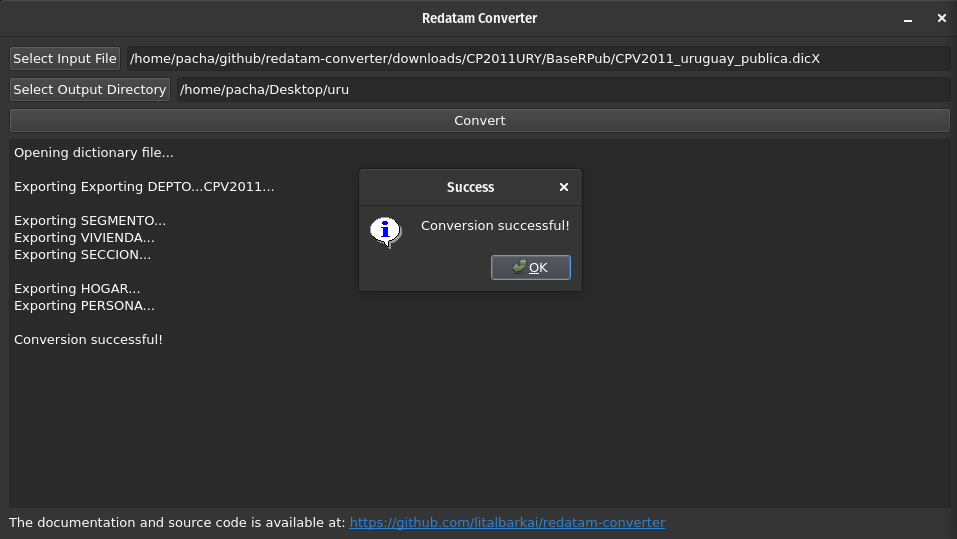

# Open Redatam 

[](https://github.com/pachadotdev/open-redatam/actions/workflows/build-ubuntu.yml)
[](https://github.com/pachadotdev/open-redatam/actions/workflows/build-mac.yml)
[](https://github.com/pachadotdev/open-redatam/actions/workflows/build-windows.yml)
[](https://github.com/pachadotdev/open-redatam/actions/workflows/build-rpkg.yml)
[](https://buymeacoffee.com/pacha)

## About

Open Redatam is an open source software for extracting raw information from REDATAM databases.

For a given census, such as the [Chilean Census 2017](https://redatam.org/cdr/descargas/censos/poblacion/CP2017CHL.zip), run the following command:

```bash
redatam input-dir/dictionary.dicx output-dir
```

Or use the desktop app:



The REDATAM database will be exported to CSV files and an XML summary of the tables and variables. It was created to recover information of REDATAM databases for statistical analysis using standard tools such as SPSS, STATA, R, etc.

This software is a full C++ ground-up rewrite of the original [open-redatam](https://github.com/discontinuos/open-redatam/blob/master/README-EN.md) created by Pablo de Grande and written in C#. Rewriting the original C# code in C++ allows for better portability and the ability to use the program within R, Python, and other languages.

**For the R package that allows to directly read REDATAM databases in R, see the [rpkg](rpkg) directory.**

**For the Python package that allows to directly read REDATAM databases in Python, see the [pypkg](pypkg) directory.**

## Installation

### From binaries

On Ubuntu, run the following commands:

```bash
# needs "sudo apt install gdebi-core" if you don't have gdebi
wget https://github.com/pachadotdev/open-redatam/releases/download/v0.1/redatam_0.1_amd64.deb
sudo dpkg -i redatam_0.1_amd64.deb
```

This will install `redatam` and `redatamgui` in `/usr/local/bin/` with the necessary dependencies and a desktop entry.

On Mac, run the following command:

```bash
sudo bash -c "$(wget -qO- https://raw.githubusercontent.com/pachadotdev/open-redatam/main/install/mac.sh)"
```

This will install `redatam` and `redatamgui` in `/usr/local/bin/`.

On Windows, download the [latest release](https://github.com/pachadotdev/open-redatam/releases/download/v0.1/redatam-windows.zip) and extract it. The executables are `redatam` and `redatamgui` directories, and ZIP is self-contained to ensure that the software works without extra software.

### From source

The software requires C++11 or higher to compile.

On Linux, run the following commands:

```bash
git clone https://github.com/pachadotdev/open-redatam.git
sudo apt-get update
sudo apt-get install -y qtbase5-dev qtbase5-dev-tools qt5-qmake
make
```

Then run `./redatam` or `./redatamgui`.

On Mac, run the following commands:

```bash
git clone https://github.com/pachadotdev/open-redatam.git
brew install qt@5
export PATH="/opt/homebrew/opt/qt@5/bin:$PATH"
export LDFLAGS="-L/opt/homebrew/opt/qt@5/lib"
export CPPFLAGS="-I/opt/homebrew/opt/qt@5/include"
export PKG_CONFIG_PATH="/opt/homebrew/opt/qt@5/lib/pkgconfig"
make
```

Then run `./redatam` or `./redatamgui`.

On Windows, you need [Visual Studio Code 2019 with C++ development tools](https://web.archive.org/web/20211009045628if_/https://download.visualstudio.microsoft.com/download/pr/1051e775-b2c9-4b7a-a227-1e60bffe102a/c758f79e86d619d6d1998fd67820f4970d803c28f447f503acc183df003719ec/vs_Community.exe) and [Qt 5 for MSVC 2019 64-bit](https://d13lb3tujbc8s0.cloudfront.net/onlineinstallers/qt-online-installer-windows-x64-4.8.0.exe).

Then run the following commands:

```bash
git clone https://github.com/pachadotdev/open-redatam.git

cd redatamwindows
cmake -G "Visual Studio 16 2019" .
cmake --build . --config Release
cmake --install . --config Release

cd redatamguiwindows
cmake . -G "Visual Studio 16 2019"
cmake --build . --config Release
"C:\Qt\5.15.2\msvc2019_64\bin\windeployqt.exe" --release .\Release\redatamgui.exe
cd ..
```

## Testing

Ticked = Passed; Blank = Failed

### DIC format

- [ ] Argentina 2010 (`CP2010ARG/BASE_AMP_DPTO/CPV2010Ampliado.dic`)
- [ ] Bolivia 2001 (`CP2001BOL/Cp2001BOL/BaseOriginal/CPV2001.dic`)
- [ ] Bolivia 2001 CELADE (`CP2001BOL/Cp2001BOL/Celade/CPV2001BOL_Celade.dic`)
- [x] Bolivia 2012 (`CP2012BOL/BaseMunicipio_V3/CPV2012Municipio.dic`)
- [x] Chile 2017 (`CP2017CHL/BaseOrg16/CPV2017-16.dic`)
- [x] Dominican Republic 2002 (`CP2002DOM/Cp2002DOM/BaseOriginal/CPV2002DOM.dic`)
- [x] Ecuador 2015 (`CP2010ECU/Base/CE11.dic`)
- [x] Ecuador (Galapagos) 2015 (`test/galapagos/cg15.dic`)
- [x] El Salvador 2007 (`CP2007SLV/CP2007SLV/BaseTotal/CPV2007ES.dic`)
- [ ] Guatemala 2018 (`CP2018GTM/BasePub/CPV2018GT_BasePublica.dic`)
- [x] Mexico 2000 (`CP2000MEX/Cp2000MEX/BaseOriginal/cpmx2000.dic`)
- [ ] Mexico 2010 (`CP2010MEX/BasePubM/MC10.dic`)
- [x] Myanmar 2014 (`CP2014MMR/Union.dic`)
- [ ] Peru 2010 (`CP2010PER/CP2007PER/BasePub/CPV2007PER_PUB.dic`)
- [ ] Peru 2017 (`CP2017PER/BaseD/BaseR/CPVPER2017D.dic`)
- [ ] Uruguay 2011 (`CP2000MEX/Cp2000MEX/BaseOriginal/cpmx2000.dic`) *corrupted file*

### DICX format

- [x] Argentina 2010 (`CP2010ARG/BASE_AMP_DPTO/CPV2010Ampliado.dicx`)
- [ ] Bolivia 2001 (`CP2001BOL/Cp2001BOL/BaseOriginal/CPV2001.dicx`)
- [ ] Bolivia 2001 CELADE (`CP2001BOL/Cp2001BOL/Celade/CPV2001BOL_Celade.dicx`)
- [x] Bolivia 2012 (`CP2012BOL/BaseMunicipio_V3/CPV2012Comunidad.dicx`)
- [x] Chile 2017 (`CP2017CHL/BaseOrg16/CPV2017-16.dicx`)
- [x] Dominican Republic 2002 (`CP2002DOM/Cp2002DOM/BaseOriginal/CPV2002DOM.dicx`)
- [x] Ecuador 2010 (`CP2010ECU/Base/cpv2010ecu.dicx`)
- [x] Ecuador (Galapagos) 2015 (`test/galapagos/cg15.dicX`)
- [x] El Salvador 2007 (`CP2007SLV/CP2007SLV/BaseTotal/CPV2007ES.dicx`)
- [x] Mexico 2000 (`CP2000MEX/Cp2000MEX/BaseOriginal/cpmx2000.dicx`)
- [x] Mexico 2010 (`CP2010MEX/BasePubM/MC10.dicx`)
- [x] Mexico 2015 (`ECI2015MEX/BaseR/ECI2015MX.dicX`)
- [x] Peru 2010 (`CP2010PER/CP2007PER/BasePub/CPV2007PER_PUB.dicx`)
- [x] Uruguay 2011 (`CP2011URY/CP2011URY/BaseRPub/CPV2011_uruguay_publica.dicX`)

## Credits

Open Redatam was created and is supported by Lital Barkai (barkailital@gmail.com).

The tests, installation instructions and R and Python package were created by Mauricio "Pacha" Vargas Sepulveda (m.sepulveda@mail.utoronto.ca)

The original converter was created by Pablo De Grande. See [here](https://www.scielo.org.mx/scielo.php?script=sci_arttext&pid=S0186-72102016000300811) for more information.

This project uses [pugixml](https://github.com/zeux/pugixml) created by Arseny Kapoulkine to structure a part of the output data.
