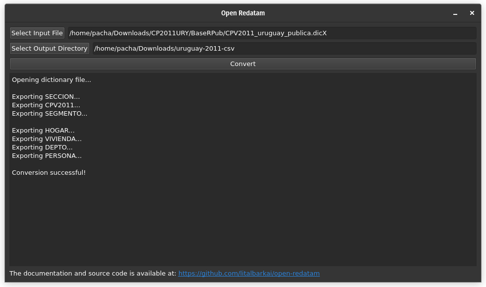

# Open Redatam 

[](https://github.com/pachadotdev/open-redatam/actions/workflows/build-ubuntu.yml)
[](https://github.com/pachadotdev/open-redatam/actions/workflows/build-mac.yml)
[](https://github.com/pachadotdev/open-redatam/actions/workflows/build-windows.yml)
[](https://github.com/pachadotdev/open-redatam/actions/workflows/build-rpkg.yml)
[](https://github.com/pachadotdev/open-redatam/actions/workflows/build-pypkg.yml)
[](https://buymeacoffee.com/pacha)

## About

Open Redatam is an open source software for extracting raw information from REDATAM databases.

For a given census, such as the [Chilean Census 2017](https://redatam.org/cdr/descargas/censos/poblacion/CP2017CHL.zip), run the following command:

```bash
redatam input-dir/dictionary.dicx output-dir
```

Or use the desktop app:



The REDATAM database will be exported to CSV files and an XML summary of the tables and variables. It was created to recover information of REDATAM databases for statistical analysis using standard tools such as SPSS, STATA, R, etc.

This software is a full C++ ground-up rewrite of the original [open-redatam](https://github.com/discontinuos/open-redatam/blob/master/README-EN.md) created by Pablo de Grande and written in C#. Rewriting the original C# code in C++ allows for better portability and the ability to use the program within R, Python, and other languages.

**For the R package that allows to directly read REDATAM databases in R, see the [rpkg](rpkg) directory.**

**For the Python package that allows to directly read REDATAM databases in Python, see the [pypkg](pypkg) directory.**

## Installation

### From binaries

On Ubuntu, run the following commands:

```bash
# needs "sudo apt install gdebi-core" if you don't have gdebi
wget https://github.com/pachadotdev/open-redatam/releases/download/v0.2/redatam_0.2_amd64.deb
sudo dpkg -i redatam_0.2_amd64.deb
```

This will install `redatam` and `redatamgui` in `/usr/local/bin/` with the necessary dependencies and a desktop entry.

On Mac, run the following command:

```bash
sudo bash -c "$(wget -qO- https://raw.githubusercontent.com/pachadotdev/open-redatam/main/install/mac.sh)"
```

This will install `redatam` and `redatamgui` in `/usr/local/bin/`.

On Windows, download the [latest release](https://github.com/pachadotdev/open-redatam/releases/download/v0.2/redatam-windows.zip) and extract it. The executables are `redatam` and `redatamgui` directories, and ZIP is self-contained to ensure that the software works without extra software.

### From source

The software requires C++11 or higher to compile.

On Linux, run the following commands:

```bash
git clone https://github.com/pachadotdev/open-redatam.git
sudo apt-get update
sudo apt-get install -y qtbase5-dev qtbase5-dev-tools qt5-qmake
make
```

Then run `./redatam` or `./redatamgui`.

On Mac, run the following commands:

```bash
git clone https://github.com/pachadotdev/open-redatam.git
brew install qt@5
export PATH="/opt/homebrew/opt/qt@5/bin:$PATH"
export LDFLAGS="-L/opt/homebrew/opt/qt@5/lib"
export CPPFLAGS="-I/opt/homebrew/opt/qt@5/include"
export PKG_CONFIG_PATH="/opt/homebrew/opt/qt@5/lib/pkgconfig"
make
```

Then run `./redatam` or `./redatamgui`.

On Windows, you need [Visual Studio Code 2019 with C++ development tools](https://web.archive.org/web/20211009045628if_/https://download.visualstudio.microsoft.com/download/pr/1051e775-b2c9-4b7a-a227-1e60bffe102a/c758f79e86d619d6d1998fd67820f4970d803c28f447f503acc183df003719ec/vs_Community.exe) and [Qt 5 for MSVC 2019 64-bit](https://d13lb3tujbc8s0.cloudfront.net/onlineinstallers/qt-online-installer-windows-x64-4.8.0.exe).

Then run the following commands:

```bash
git clone https://github.com/pachadotdev/open-redatam.git

cd redatamwindows
cmake -G "Visual Studio 16 2019" .
cmake --build . --config Release
cmake --install . --config Release

cd redatamguiwindows
cmake . -G "Visual Studio 16 2019"
cmake --build . --config Release
"C:\Qt\5.15.2\msvc2019_64\bin\windeployqt.exe" --release .\Release\redatamgui.exe
cd ..
```

## Testing

### Reading

Ticked = Passed; Blank = Failed

#### DIC format

- [x] Argentina 1991 (`CP1991ARG/datos/Arg91CPV.dic`)
- [x] Argentina 2001 (`CP2001ARG-DATA/CpvAr01_pub_v12.dic`)
- [x] Argentina 2010 (`CP2010ARG/BASE_AMP_DPTO/CPV2010Ampliado.dic`)
- [x] Bolivia 2001 (`CP2001BOL/Cp2001BOL/BaseOriginal/CPV2001.dic`)
- [x] Bolivia 2012 (`CP2012BOL/BaseMunicipio_V3/CPV2012Municipio.dic`)
- [x] Chile 2017 (`CP2017CHL/BaseOrg16/CPV2017-16.dic`)
- [x] Dominican Republic 2002 (`CP2002DOM/Cp2002DOM/BaseOriginal/CPV2002DOM.dic`)
- [x] Ecuador 2010 (`CP2010ECU/Base/CE11.dic`)
- [x] Ecuador (Galapagos) 2015 (`test/galapagos/cg15.dic`)
- [x] El Salvador 2007 (`CP2007SLV/CP2007SLV/BaseTotal/CPV2007ES.dic`)
- [x] Guatemala 2018 (`CP2018GTM/BasePub/CPV2018GT_BasePublica.dic`)
- [x] Mexico 2000 (`CP2000MEX/Cp2000MEX/BaseOriginal/cpmx2000.dic`)
- [ ] Mexico 2010 (`CP2010MEX/BasePubM/MC10.dic`)
- [x] Myanmar 2014 (`CP2014MMR/Union.dic`)
- [x] Peru 2010 (`CP2007PER/CP2007PER/BasePub/CPV2007PER_PUB.dic`)
- [x] Peru 2017 (`CP2017PER/BaseD/BaseR/CPVPER2017D.dic`)
- [x] Uruguay 2011 (`CP2000MEX/Cp2000MEX/BaseOriginal/cpmx2000.dic`)

#### DICX format

- [x] Argentina 2010 (`CP2010ARG/BASE_AMP_DPTO/CPV2010Ampliado.dicx`)
- [x] Bolivia 2001 (`CP2001BOL/Cp2001BOL/BaseOriginal/CPV2001.dicx`)
- [x] Bolivia 2012 (`CP2012BOL/BaseMunicipio_V3/CPV2012Comunidad.dicx`)
- [x] Chile 2017 (`CP2017CHL/BaseOrg16/CPV2017-16.dicx`)
- [x] Dominican Republic 2002 (`CP2002DOM/Cp2002DOM/BaseOriginal/CPV2002DOM.dicx`)
- [x] Ecuador 2010 (`CP2010ECU/Base/cpv2010ecu.dicx`)
- [x] Ecuador (Galapagos) 2015 (`test/galapagos/cg15.dicX`)
- [x] El Salvador 2007 (`CP2007SLV/CP2007SLV/BaseTotal/CPV2007ES.dicx`)
- [x] Mexico 2000 (`CP2000MEX/Cp2000MEX/BaseOriginal/cpmx2000.dicx`)
- [x] Mexico 2010 (`CP2010MEX/BasePubM/MC10.dicx`)
- [x] Mexico 2015 (`ECI2015MEX/BaseR/ECI2015MX.dicX`)
- [x] Peru 2007 (`CP2007PER/CP2007PER/BasePub/CPV2007PER_PUB.dicx`)
- [x] Uruguay 2011 (`CP2011URY/CP2011URY/BaseRPub/CPV2011_uruguay_publica.dicX`)

### Validation against IPUMS data

A simple validation exercise is to compare counts and percentages by sex and age groups against the [IPUMS](https://international.ipums.org/international/index.shtml) data to determine if the data was converted correctly.

Some census files feature a sample. For this exercise, we used the dictionaries for four countries containing the universe data in DIC and DICX formats.

#### Chile 2017

DIC and DICX parsing leads to the same results.

```r
  sex        n_ipums pct_ipums  n_rdtm pct_rdtm n_diff pct_diff
  <int+lbl>    <dbl>     <dbl>   <int>    <dbl>  <dbl>    <dbl>
1 1 [Male]   8607570      49.0 8601989     48.9   5581   0.0457
2 2 [Female] 8961420      51.0 8972014     51.1 -10594  -0.0457
```

```r
   age2          n_ipums pct_ipums  n_rdtm pct_rdtm n_diff pct_diff
   <int+lbl>       <dbl>     <dbl>   <int>    <dbl>  <dbl>    <dbl>
 1  1 [0 to 4]   1157530      6.59 1166146     6.64  -8616 -0.0471 
 2  2 [5 to 9]   1215960      6.92 1210189     6.89   5771  0.0348 
 3  3 [10 to 14] 1147610      6.53 1147415     6.53    195  0.00297
 4  4 [15 to 19] 1236800      7.04 1244697     7.08  -7897 -0.0429 
 5 12 [20 to 24] 1384320      7.88 1387822     7.90  -3502 -0.0177 
 6 13 [25 to 29] 1475500      8.40 1474150     8.39   1350  0.0101 
 7 14 [30 to 34] 1294480      7.37 1293637     7.36    843  0.00690
 8 15 [35 to 39] 1202670      6.85 1207777     6.87  -5107 -0.0271 
 9 16 [40 to 44] 1195460      6.80 1198503     6.82  -3043 -0.0154 
10 17 [45 to 49] 1162380      6.62 1160763     6.61   1617  0.0111 
11 18 [50 to 54] 1186210      6.75 1184954     6.74   1256  0.00907
12 19 [55 to 59] 1047910      5.96 1047779     5.96    131  0.00245
13 20 [60 to 64]  849470      4.84  846915     4.82   2555  0.0159 
14 21 [65 to 69]  656700      3.74  653002     3.72   3698  0.0221 
15 22 [70 to 74]  518120      2.95  515909     2.94   2211  0.0134 
16 23 [75 to 79]  365350      2.08  363589     2.07   1761  0.0106 
17 24 [80 to 84]  240640      1.37  239446     1.36   1194  0.00718
18 25 [85+]       231880      1.32  231310     1.32    570  0.00362
```

#### Bolivia 2001

DIC and DICX parsing leads to the same results.

```r
  sex        n_ipums pct_ipums  n_rdtm pct_rdtm n_diff pct_diff
  <int+lbl>    <dbl>     <dbl>   <int>    <dbl>  <dbl>    <dbl>
1 1 [Male]   4128270      49.9 4123850     49.8   4420   0.0378
2 2 [Female] 4148650      50.1 4150475     50.2  -1825  -0.0378
```

```r
   age2          n_ipums pct_ipums  n_rdtm pct_rdtm
   <int+lbl>       <dbl>     <dbl>   <int>    <dbl>
 1  1 [0 to 4]   1085440    13.1   1087557   13.1  
 2  2 [5 to 9]   1084870    13.1   1083747   13.1  
 3  3 [10 to 14] 1029920    12.4   1026770   12.4  
 4  4 [15 to 19]  871360    10.5    873251   10.6  
 5 12 [20 to 24]  782980     9.46   780471    9.43 
 6 13 [25 to 29]  610780     7.38   611381    7.39 
 7 14 [30 to 34]  521900     6.31   522220    6.31 
 8 15 [35 to 39]  471910     5.70   469765    5.68 
 9 16 [40 to 44]  415010     5.01   414170    5.01 
10 17 [45 to 49]  338060     4.08   336376    4.07 
11 18 [50 to 54]  275660     3.33   274548    3.32 
12 19 [55 to 59]  212640     2.57   214810    2.60 
13 20 [60 to 64]  165860     2.00   166616    2.01 
14 21 [65 to 69]  143960     1.74   143287    1.73 
15 22 [70 to 74]  118580     1.43   121053    1.46 
16 23 [75 to 79]   74370     0.899   74682    0.903
17 24 [80 to 84]   40440     0.489   40344    0.488
18 25 [85+]        33180     0.401   33277    0.402
```

#### Bolivia 2012

DIC and DICX parsing leads to the same results.

```r
  sex         n_ipums pct_ipums  n_rdtm pct_rdtm n_diff pct_diff
  <int+lbl>     <dbl>     <dbl>   <int>    <dbl>  <dbl>    <dbl>
1 1 [Male]   5020766.      49.9 5019447     49.9  1319.  0.00839
2 2 [Female] 5040041.      50.1 5040409     50.1  -368. -0.00839
```

```r
   age2           n_ipums pct_ipums  n_rdtm pct_rdtm
   <int+lbl>        <dbl>     <dbl>   <int>    <dbl>
 1  1 [0 to 4]   1091540.    10.8   1089948   10.8  
 2  2 [5 to 9]    988984.     9.83   992654    9.87 
 3  3 [10 to 14] 1076853.    10.7   1078164   10.7  
 4  4 [15 to 19] 1107708.    11.0   1106284   11.0  
 5 12 [20 to 24]  981961.     9.76   978606    9.73 
 6 13 [25 to 29]  812924.     8.08   817395    8.13 
 7 14 [30 to 34]  754287.     7.50   753831    7.49 
 8 15 [35 to 39]  631461.     6.28   631032    6.27 
 9 16 [40 to 44]  543112.     5.40   544701    5.41 
10 17 [45 to 49]  461436.     4.59   461984    4.59 
11 18 [50 to 54]  404489.     4.02   403220    4.01 
12 19 [55 to 59]  322182.     3.20   324025    3.22 
13 20 [60 to 64]  280089.     2.78   279867    2.78 
14 21 [65 to 69]  207331.     2.06   204529    2.03 
15 22 [70 to 74]  152851.     1.52   152423    1.52 
16 23 [75 to 79]   99799.     0.992   99276    0.987
17 24 [80 to 84]   81862.     0.814   81095    0.806
18 25 [85+]        61937.     0.616   60822    0.605
```

#### Ecuador 2010

DIC and DICX parsing leads to the same results.

```r
  sex        n_ipums pct_ipums  n_rdtm pct_rdtm n_diff pct_diff
  <int+lbl>    <dbl>     <dbl>   <int>    <dbl>  <dbl>    <dbl>
1 1 [Male]   7178200      49.6 7177683     49.6    517  0.00757
2 2 [Female] 7304130      50.4 7305816     50.4  -1686 -0.00757
```

```r
   age2          n_ipums pct_ipums  n_rdtm pct_rdtm
   <int+lbl>       <dbl>     <dbl>   <int>    <dbl>
 1  1 [0 to 4]   1459980    10.1   1462277   10.1  
 2  2 [5 to 9]   1530380    10.6   1526806   10.5  
 3  3 [10 to 14] 1542170    10.6   1539342   10.6  
 4  4 [15 to 19] 1421490     9.82  1419537    9.80 
 5 12 [20 to 24] 1288560     8.90  1292126    8.92 
 6 13 [25 to 29] 1203030     8.31  1200564    8.29 
 7 14 [30 to 34] 1066870     7.37  1067289    7.37 
 8 15 [35 to 39]  941870     6.50   938726    6.48 
 9 16 [40 to 44]  819470     5.66   819002    5.65 
10 17 [45 to 49]  753060     5.20   750141    5.18 
11 18 [50 to 54]  608370     4.20   610132    4.21 
12 19 [55 to 59]  513910     3.55   515893    3.56 
13 20 [60 to 64]  397050     2.74   400759    2.77 
14 21 [65 to 69]  322970     2.23   323817    2.24 
15 22 [70 to 74]  238280     1.65   240091    1.66 
16 23 [75 to 79]  164550     1.14   165218    1.14 
17 24 [80 to 84]  115750     0.799  115552    0.798
18 25 [85+]        94570     0.653   96227    0.664
```

#### Uruguay 2011

```r
  sex        n_ipums pct_ipums  n_rdtm pct_rdtm n_diff pct_diff
  <int+lbl>    <dbl>     <dbl>   <int>    <dbl>  <dbl>    <dbl>
1 1 [Male]   1577700      48.0 1577416     48.0    284   0.0324
2 2 [Female] 1706550      52.0 1708461     52.0  -1911  -0.0324
```

```r
   age2          n_ipums pct_ipums n_rdtm pct_rdtm n_diff pct_diff
   <int+lbl>       <dbl>     <dbl>  <int>    <dbl>  <dbl>    <dbl>
 1  1 [0 to 4]    219860      6.69 220345     6.71   -485 -0.0114 
 2  2 [5 to 9]    236080      7.19 238068     7.25  -1988 -0.0569 
 3  3 [10 to 14]  255570      7.78 256552     7.81   -982 -0.0260 
 4  4 [15 to 19]  263090      8.01 261691     7.96   1399  0.0465 
 5 12 [20 to 24]  240700      7.33 241006     7.33   -306 -0.00568
 6 13 [25 to 29]  229820      7.00 228385     6.95   1435  0.0471 
 7 14 [30 to 34]  232930      7.09 233365     7.10   -435 -0.00973
 8 15 [35 to 39]  221690      6.75 222521     6.77   -831 -0.0219 
 9 16 [40 to 44]  203740      6.20 203098     6.18    642  0.0226 
10 17 [45 to 49]  198160      6.03 198773     6.05   -613 -0.0157 
11 18 [50 to 54]  195040      5.94 194565     5.92    475  0.0174 
12 19 [55 to 59]  172560      5.25 173007     5.27   -447 -0.0110 
13 20 [60 to 64]  151050      4.60 150775     4.59    275  0.0106 
14 21 [65 to 69]  132090      4.02 131563     4.00    527  0.0180 
15 22 [70 to 74]  111500      3.39 112395     3.42   -895 -0.0256 
16 23 [75 to 79]   94810      2.89  93659     2.85   1151  0.0365 
17 24 [80 to 84]   69880      2.13  70505     2.15   -625 -0.0180 
18 25 [85+]        55680      1.70  55604     1.69     76  0.00315
```

## References

De Grande, Pablo. 2016. “El formato Redatam.” Estudios demográficos y urbanos 31 (3): 811–32.
Ruggles, Steven, Lara Cleveland, Rodrigo Lovaton, Sula Sarkar, Matthew Sobek, Derek Burk, Dan Ehrlich, Quinn Heimann, and Jane Lee. 2024. “Integrated Public Use Microdata Series (IPUMS).” 2024. https://international.ipums.org/international/.

## Credits

Open Redatam was created and is supported by Lital Barkai (barkailital@gmail.com).

The tests, installation instructions and R and Python package were created by Mauricio "Pacha" Vargas Sepulveda (m.sepulveda@mail.utoronto.ca)

The original converter was created by Pablo De Grande. See [here](https://www.scielo.org.mx/scielo.php?script=sci_arttext&pid=S0186-72102016000300811) for more information.

This project uses [pugixml](https://github.com/zeux/pugixml) created by Arseny Kapoulkine to structure a part of the output data.

The author wishes to acknowledge the statistical offices that provided the underlying data used for the validation: National Institute of Statistics, Bolivia; National Institute of Statistics, Chile; National Institute of Statistics and Censuses, Ecuador; National Institute of Statistics, Uruguay.
