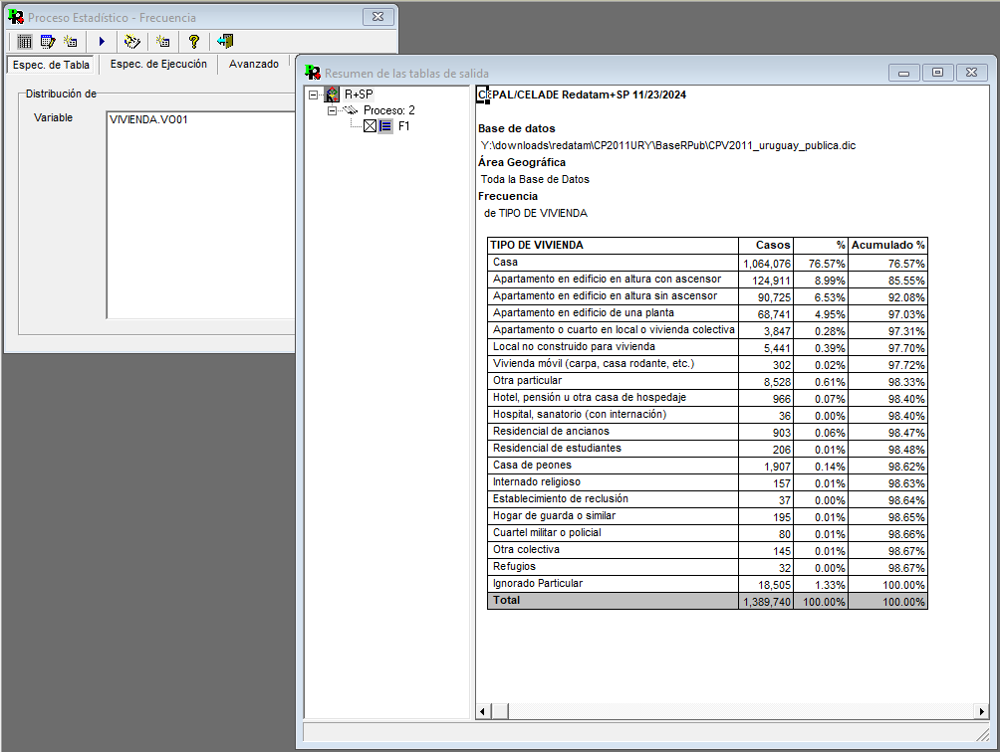
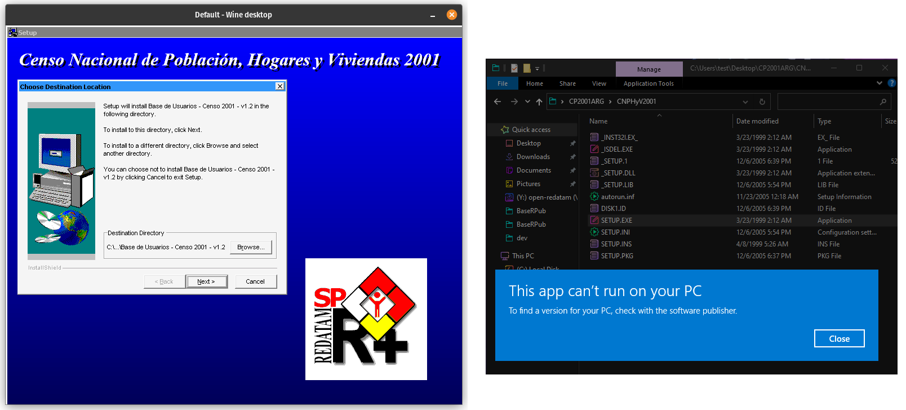
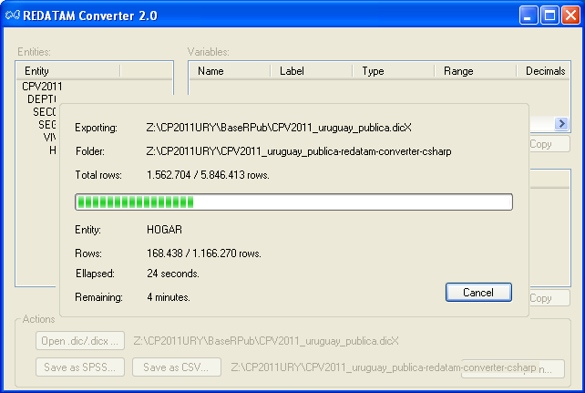
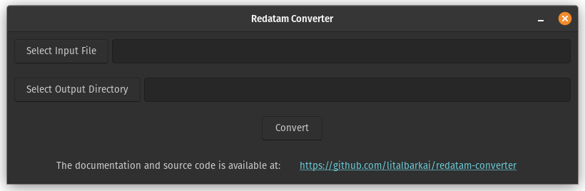
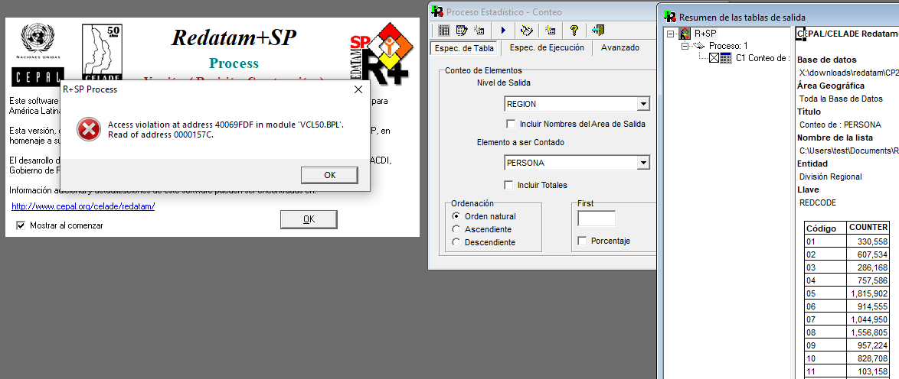

# Introduction

The REDATAM (Retrieval of Data for Small Areas by Microcomputer, *Recuperación
de Datos para Areas pequeñas por Microcomputador* in Spanish) statistical
package and format, developed by ECLAC (Economic Commission for Latin America
and the Caribbean, *CEPAL* in Spanish), remains a widely used tool in census
data dissemination across Latin America. However, almost a decade after the
original academic critique on the REDATAM format in @de_grande_formato_2016,
concerns persist regarding its limitations, including its proprietary nature,
lack of transparency, and shortcomings related to the lack of flexibility for
data analysis. These issues remain critical for researchers in economics,
political science and sociology, as access to data becomes increasingly
important because of the increased proportion of quantitative studies in these
fields, and policymakers and the public are interested in insights that
contribute to better policy outcomes [@farrell_how_2019].

For readers unfamiliar with the REDATAM data format, it is a binary format, a
representation that it is not possible to open with software such as "Notepad"
as we can do with a CSV file to see its contents. The downloaded files do not
have a "redatam" extension, the main file is a dictionary with a "dic" or
"dicx" extension, and each level (e.g., region, municipality, or household) has
its own pointers file with a "ptr" extension and data files with a "rbf"
extension where each data file contains a single variable.

Consider the following table derived from the 2017 Chilean census data, which
shows the population by sex at the country level:

```{r chl1, echo=FALSE, warning=FALSE, message=FALSE}
library(dplyr)

chl17 <- readRDS("data/chl17_pop.rds")

chl17_pop <- chl17 %>%
  group_by(sex = p08) %>%
  count() %>%
  mutate(
    p = n / sum(n),
    sex = ifelse(sex == 1, "Males", "Females")
  ) %>%
  select(sex, n) %>%
  arrange(-n)

knitr::kable(chl17_pop,
  col.names = c("Sex", "Population"),
  format.args = list(big.mark = ","),
  caption = "Population in sex in Chile (2017)."
)
```

Similarly, consider the following table derived from the 2017 Chilean census
data, which shows the total population at region level:

```{r chl2, echo=FALSE, warning=FALSE, message=FALSE}
chl17_pop <- chl17 %>%
  group_by(region = nregion) %>%
  count() %>%
  select(region, n) %>%
  ungroup() %>%
  mutate(
    region = c("Antofagasta", "Arica y Parinacota", "Atacama", "Aysen",
      "Biobio", "Coquimbo", "La Araucania", "O'Higgins", "Los Lagos",
      "Los Rios", "Magallanes", "Maule", "Metropolitana", "Tarapaca",
      "Valparaiso", "Nuble")
  ) %>%
  arrange(-n)

knitr::kable(chl17_pop,
  col.names = c("Region", "Population"),
  format.args = list(big.mark = ","),
  caption = "Population by region in Chile (2017)."
)
```

These tables are obtained after reading multiple "rbf" files and merging them.
To obtain these counts, REDATAM R+SP Process (not related to the R programming
language) is the official software and it includes a Graphic User Interface
(GUI) that allows to export variables using a point-and-click menu. The main
drawback of this approach is that it can be time consuming to apply multiple
filters and export several variables, and it does not allow more advanced
analysis such as ANOVA or Poisson regression. However, the same software
includes a command prompt that lets the user use syntax like Scripting Query
Language (SQL) to export data but does not provide functions to test statistical
hypotheses. 

```{r redatamsp, echo=FALSE, warning=FALSE, message=FALSE, fig.cap="REDATAM SP main window", fig.align="center"}

```

# Data versus information

The distinction between data and information is crucial for understanding the
role of REDATAM in public policy. Data refers to raw facts or observations that
lack context or meaning. In contrast, information is data that has been
processed, organized, or structured to convey meaning or support decision-making
[@james_c_king_data_2010]. The REDATAM format, with its current lack of an
official format specification, creates a bottleneck in transforming raw census
data into information for policymakers, researchers, and the public. The REDATAM
software does not provide the tools necessary to perform statistical analyses,
such as (generalized) linear regression, limiting the potential insights that
can be derived from census data. It even makes it challenging to obtain averages
and count different sub-national units by presenting a point-and-click graphic
interface that restricts the analysis [@eclac_tutorial_2023].

These limitations underscore the importance of data access in the context of
public policy analysis. Besides an academic concern about challenges in data
processing because of a closed source format and restrictive software, this
affects advocacy groups and Non-Governmental Organizations (NGOs) that can
inform policy design, implementation and change by bringing expert knowledge
combined with information derived from census data to characterize populations
[@jenkins_smith_advocacy_2018].

Operational barriers, such as insufficient infrastructure and limited processing
capacity, hinder the ability to leverage open data effectively
[@kawashita_open_2022]. Many organizations face challenges related to
organizational capabilities to manage and analyze open data, resulting in missed
opportunities to enhance policy design and civic engagement. Considering that
governments already covered the cost of producing and releasing census records,
using open formats for their release could enhance civic participation and
policy design by enabling NGOs to analyze data with already popular tools such
as R or Python. This change has an economic and financial impact that would be
marginal for governments, and currently the cost of converting REDATAM data to
open format is marginal (e.g., it requires a user to read the instructions) with
the Open-Source tool we developed for any organization that wants to use it.

Beyond the technical and operational, the interplay of policy and legal
frameworks significantly affects software utilities. Open source initiatives
often use licensing terms that can limit derivative works. For instance,
the GNU GPL license requires that derivative works be distributed under the same
copyleft license, and currently around 15,000 out of 21,000 of R packages (70%)
are GPL-licensed. Advocacy groups and NGOs encounter additional challenges
when navigating these barriers, their efforts to combine expert knowledge with
census data to inform and influence policies are often constrained by such
restrictions, reducing their effectiveness in driving evidence-based governance​
[@kawashita_open_2022]. For this reason, Open REDATAM is distributed under the
Apache license, which allows users to use, modify, and distribute the software
freely, even for commercial uses if the authors of this article are listed as
the copyright owners of the original software and therefore trademark use of our
work is not allowed.

Addressing these barriers requires comprehensive strategies that include
fostering a culture of openness, strengthening institutional infrastructure, and
advocating for legal frameworks that accompany open data access with permissive
software licenses for policy analysis that preserve individual data privacy but
expose policy gaps and failures affecting target populations. These measures are
relevant for virtuous policy processes with the participation and feedback from
empowered citizens and advocacy coalitions, therefore enhancing democratic
practices and accountability​ [@jenkins_smith_advocacy_2018].

The relationship between data and information emphasizes the transformative
potential of addressing these barriers. Data, as raw material, gains its value
when transformed into information (e.g., tables or plots) that drive actionable
insights. REDATAM's current limitations impede this transformation, leaving
users with raw data that is difficult to process and contextualize, creating a
barrier for NGOs and governmental technical teams to better inform policy makers
about policy challenges.

By embracing open formats, governments can enable policymakers, researchers, and
advocacy groups to better utilize already existing data with free (e.g., free in
monetary cost) tools for data analysis. Without civic participation it is
challenging to adopt a paradigmatic change from data to information to uncover
systemic inequities, develop targeted interventions, and engage in a
better-informed policy debate. Bridging the gap between data and information is
not just a technical necessity, it is a cornerstone for fostering transparency,
inclusivity, and effective governance that could lead to paradigmatic changes in
policy design [@hall_policy_1993; @blyth_paradigms_2013;@broome_bad_2018].

Data is different from information, the first often requires transformations
from raw text or numbers in documents, images or SQL databases into summaries
and interpretations that can inform policy decisions. Structured data, such
as Excel spreadsheets or REDATAM files, adheres to a predefined structure,
making it easier to query, analyze, and integrate compared to unstructured data.
Unstructured data, such as scanned documents or images from traffic cameras,
lacks this inherent organization, presenting obstacles in terms of processing
it to inform policy design. Both forms of data inherit difficulties including
discrepancies and mismanagement, and obtaining information from them can present
additional technical issues when facing unsearchable formats like scanned PDFs
[@beltran_fiscal_2023].

In order to bridge the gap between data and information, computational tools
such as Optical Character Recognition (OCR) and Natural Language Processing
(NLP) facilitate processing and interpreting data presented in format that posit
a challenge to read and analyze figures, as it it the case of rescuing and
harmonizing monetary figures and contextual details in fiscal budgets
[@beltran_fiscal_2023]. These methodologies demonstrate how data, regardless of
the format, can be processed and combined with sector knowledge to identify
patterns, such as recurring fiscal irregularities or trends in budgetary
compliance, that structured data alone might not capture.

Similarly, the goal of REDATAM is to help to organize raw data to produce
information that not only enhances transparency but also equips policymakers
with an input that adds to specialized knowledge and other sources to maintain,
alter or create policies. Under the Multiple Streams Framework (MSF), the
process of transforming data into information can affect the interaction between
policy, politics, and problems. Policymakers aim at organizing an agenda facing
limited resources, including time and information, to provide solutions, and
face trade-offs between precision and ambiguity when internalizing information
to prepare responses to problems in a context where disagreement among experts
facing the same information is a part of effective planning
[@sanjurjo_taking_2020, @herweg_multiple_2018, @ackrill_ambiguity_2013].

# Data access versus statistical secret

Since its inception in 1986, REDATAM has become a standard for distributing
census data in countries like Argentina, Colombia, Chile, and Mexico. While the
software's availability at no cost and its integration into national statistical
systems have boosted its adoption, the format it uses to store microdata remains
closed and poorly documented. This lack of transparency has raised concerns in
both academic and policy-making circles, where access to comprehensive datasets
is critical for informed decision-making.

Policy outcomes can be improved by using accurate demographic information in the
different stages of policy processes. The closed nature of the REDATAM format
hinders the ability of researchers and analysts to perform statistical analyses
beyond the simple tabulations the software allows or at least with relative
ease.

It is important to mention that we followed an unofficial
format specification provided by @de_grande_formato_2016 to develop Open
REDATAM, and without it we could not have created the tool. The lack of an
official format specification constitutes what is known as security by
obscurity. It is considered a bad practise as it consists of relying on the
secrecy of the format to protect the data, and it is often a matter of time
until the format is reverse-engineered or a vulnerability is found, as
happened with the DVD format that once was considered unbreakable
[@diehl_ten_2016].

While some encryption strategies are almost impossible
to break by brute force, research shows that encryption can be broken by
accessing the hardware where the data is stored, exploiting vulnerabilities in
the software, using social engineering to obtain the encryption key, or by
finding a flaw in the encryption algorithm. This suggests that efforts should be
put toward encryption and anonymization, which are not mutually exclusive
[@krombholz_advanced_2015, @jager_how_2011]

There are also technical limitations identified in the past decade, such as the
lack of encryption and compression strategies claimed to be implemented in the
software [@de_grande_formato_2016]. This issue is not just a technical
limitation but also a potential risk to data security and confidentiality that
may emerge from an excess of confidence in security by obscurity at the expense
of data anonymization procedures that protect individual privacy while keeping
the data usable for research by allowing filtering at the unit of analysis
(e.g., individual) level. National census data often include sensitive
information that, if not properly encrypted, could compromise individual
privacy. For example, at the time of writing this article we were able to
download the
[Uruguay 2011 census microdata](https://redatam.org/cdr/descargas/censos/poblacion/CP2011URY.zip)
in REDATAM format from ECLAC site that reads "for internal use at the Uruguay
Statistical Bureau" (*"base de uso interno del INE Uruguay"* in Spanish)
[@eclac_microdatos_2023]. While we did not find any sensitive information
in the file, something like this could accidentally leak information that
could be used to identify individuals.

Balancing transparency and data access with the obligation to protect
statistical confidentiality posits a challenge for any government. The sixth
principle of the United Nations Fundamental Principles of Official Statistics
explicitly emphasizes the need to ensure confidentiality in statistical data
[@united_nations_fundamental_2014]. It mandates that data collected for
statistical purposes should not be used to identify individuals or entities,
thereby safeguarding the privacy of respondents while enabling the use of
anonymized data for policy debate. This principle is relevant for REDATAM
microdata, where sharing census data without considerations could expose
sensitive demographic and socioeconomic information.

Adhering to data privacy principles reinforces public trust in official
statistics, ensuring that individuals feel secure in providing accurate
information during data collection efforts. The empirical evidence reflects
that new immigrants tend to have a lower trust in government institutions, and
this leads to a higher non-response rate in official surveys for a target
population that is more vulnerable and more affected by inadequate policies or
the lack of policies that could help them [@sumption_how_2020]. For instance,
during the 2024 Chilean census, there were multiple messages on social media
instigating people not to answer the census questions based on the idea that
the government would use age, employment, and military service completion data
to discriminate against certain people [@fuentes_censo_2024].

Governments can be better informed by tracking changes from one census to
another to evaluate the long term impact of policies and the need for
adjustments or new policies, but using distorted data for policy design can be
worse than designing policies based on social construction or tradition, which
reinforces notions such as "the elder deserve tailored policies because of their
age" [@schneider_social_1993;@schneider_what_2009].

While open data policies aim to maximize the accessibility and usability of data
for diverse stakeholders, including policymakers, researchers, and advocacy
groups, these goals must not come at the expense of exposing sensitive
information. Open REDATAM provides a technical tool, and the discussion about
this format could be enriched if ECLAC brings insights from users and existing
frameworks such as the European Union General Data Protection Regulation, which
can provide further guidance for reconciling these competing priorities
[@zoonen_data_2020].

Another concern is the preservation of data in the long term. For instance, the
2001 Argentine census came with an installer that we could not run on Windows
10, but it worked with Wine on Ubuntu 22.04, and after installing the software
we had access to the data to convert it with our tool.

```{r image3, echo=FALSE, warning=FALSE, message=FALSE, fig.cap="2001 Argentine Census installer failing on Windows 10 but working on Ubuntu 22.04", fig.align="center"}

```

REDATAM data is stored so that it can be easily accessed and read without
needing decryption tools. This raises significant concerns, particularly as more
institutions adopt REDATAM under the assumption of confidentiality and security.
Recently, Myanmar released its 2014 census data in REDATAM format, following
from the format widespread success in Latin America [@eclac_microdatos_2023].

# Integration with other tools

Quantitative policy analysis often requires the integration of various datasets
and the use of statistical methods to test hypotheses and the effect of multiple
variables on a dependent variable of interest [@breunig_quantitative_2014].

One of REDATAM's most significant shortcomings is its incompatibility with
software such as Microsoft Excel, SPSS, R or Python, tools that are widespread
in the social sciences. REDATAM's closed format and lack of integration options
highlight the necessity of developing tools that enable broader accessibility
and usability of census data. To address these limitations, we developed Open
REDATAM, a multiplatform tool compatible with Linux, Mac, and Windows. This
tool converts REDATAM data into the universally supported CSV format, which can
be processed using popular statistical software such as R, Python, SPSS, and
Stata​. Open REDATAM also generates XML summaries of tables and variables,
facilitating access to metadata, variables description, and how the variables
are related to each other.

Our approach builds upon the foundation of the original Redatam Converter
designed by Pablo de Grande [@de_grande_formato_2016]. By rewriting
de Grande's software from a graphic tool written in C# to export to CSV into a
command line tool with an additional graphic menu written in C++, we improved
its portability and ensured compatibility with a wide range of environments.
Besides Windows, Mac, and Linux desktop systems, we tested our software with
GitHub actions to verify that it works on different server environments,
including a wide range of Linux distributions that use different C++ compilers.

@de_grande_formato_2016 original implementation is distributed as Windows-only
software. However, because de Grande has released the source code, it is
possible to modify it and get it to work on Mac or Linux, because Microsoft
offers [C# compilers](https://learn.microsoft.com/en-us/dotnet/core/install/linux)
for these operating systems.

A difficulty of C# is that there are no official R or Python tools to use C#
functions, and the REDATAM format requires a compiled language to read it
because it required to define personalized data structures that then can be
exported to R, Python, or other languages. One of the advantages of using C++ is
its integration with R and Python [@vaughan_cpp11_2024;@wenzel_pybind11_2024],
which allows for the development of user-friendly tools that can be used by
researchers and policymakers without requiring advanced programming skills.
This means that continuing to use C# to create a multiplatform tool would leave
the data import step to the user, which we avoided by providing R and Python
packages that read REDATAM data directly into these languages without the additional command line step of exporting CSV files and then read them into R or
Python.

An additional consideration is that we separated the core functions that read
the data from the GUI. This separation allowed us to create lighter R and Python
packages, and we focused our efforts and used the widely used Qt framework for
the GUI [@qt_development_2024], keeping all the code modular.

Our ground-up rewrite features R and Python packages, reducing the data access
barrier for researchers and policymakers even more by moving the data import
step from the user to the software developer following the 'Tidy Data'
principles described in @wickham_r_2023.

The image below shows the original Redatam Converter tool running on Windows XP,
where the user selects the input dictionary and the output directory. We ran
it on a ThinkPad X220 to validate Open REDATAM by comparing with the REDATAM
Converter tool for the following countries and years: Argentina (1991, 2001 and
2010), Bolivia (2001 and 2012), Chile (2017), Dominican Republic (2002),
Ecuador (2010), El Salvador (2007), Guatemala (2018), Mexico (2000), Myanmar
(2014), Peru (2007 and 2017), and Uruguay (2011).

```{r image1, echo=FALSE, warning=FALSE, message=FALSE, fig.cap="Original REDATAM Converter running on Windows XP in 2024", fig.align="center"}

```

The image below shows the new Open REDATAM, which follows a streamlined
structure that allows the user to select the input dictionary and the output
directory and then exports the data to CSV files.

```{r image4, echo=FALSE, warning=FALSE, message=FALSE, fig.cap="Open REDATAM running on Ubuntu 22.04", fig.align="center"}

```

The available Open REDATAM helps overcome the limitations of REDATAM's format,
but it is not a definitive solution to the challenges posed by the software's
closed format, and we posit the need for an official format specification
to the public. For instance, the XLSX format is a widely used format for
spreadsheets. While it was created by Microsoft to be used with Microsoft
Office, it comes with a detailed official format specification (ISO 29500) that
allows that tools such as Google Sheets or R can read and write XLSX files
[@iso_2016]. Today's globalized world is heavily dependent on standards and
protocols for data exchange, and counting on a REDATAM official format
specification could build on top of the decades of experience that the
International Organization for Standardization (ISO) has with standards for data
exchange and security of information, and ISO role in trade and commerce comes
from its ability to provide rules and guidelines that effective to ease the
duties and communication in public and private sector [@buthe_new_2011].

By converting REDATAM's obscure structure into a more widely accessible format,
this tool opens the possibility for more complex data manipulations and analysis
that REDATAM's original software does not support. To create this tool, we
followed the partial (and unofficial) specification of the REDATAM format
provided by @de_grande_formato_2016, and we tested it with all the census
microdata available from ECLAC website. A previous experience for the Chilean
2017 census microdata was described in @vargas_sepulveda_story_2021,
@vargas_sepulveda_interesting_2022 and @vargas_sepulveda_censo2017.

# Testing and comparison with IPUMS data

One of the major drawbacks of software testing, despite our efforts to test on
different operating systems and hardware architectures, is that testing proves
the absence of errors in the code but not code correctness. In other words, it
is possible to test one hundred percent of the written lines of code, and still
have functions that conduct incorrect steps, such as applying a logarithmic
transformation to a variable that should not be transformed.

We exported an aggregated table created with R and the 2011 Uruguayan census
after reading it with the Open REDATAM package to SPSS format and then read it
in REDATAM 7 and saved it in REDATAM format. The REDATAM GUI version we used
cannot import CSV files, but but this nonetheless allowed us to test that
exporting from R to SPSS, to REDATAM and then back to R does not change the
data. The lack of official documentation was solved by following the steps
described in @araujo_gonzalez_red7_2021.

The Integrated Public Use Microdata Series ([IPUMS](https://international.ipums.org/international/index.shtml))
is a widely used service that provides harmonized census data for different
countries. IPUMS data is available in a binary format with an R package to read
it, making it accessible to a wide range of users and eliminating errors derived
from incorrect data parsing because of users having to guess how to read it. The
availability of comprehensive data from IPUMS allows us to compare our data
extraction and aggregation in R with the data provided by IPUMS and thus gives
us an indirect verification of our tool's correctness.

We compared the results for the following countries and years: Bolivia (2012),
Chile (2017), Dominican Republic (2002), Ecuador (2010), El Salvador (2007),
Peru (2017), Uruguay (2011). For each country and year, we read the data in DIC
(REDATAM legacy format) and DICX (a newer but also a legacy format since 2024)
depending on the availability, and we obtained consistent results with the
IPUMS data for the same countries and years. This comparison is not a
definitive test of the correctness of our tool, but it is a step in the right
direction to ensure that the data we extract is correct and can be used for
policy analysis.

To avoid presenting cluttered information, we only provide the comparison for
the 2017 Chilean census microdata (DIC and DICX, same results) and IPUMS data in
the following tables with the aggregate count by sex at country level:

```{r ipums1, echo=FALSE, warning=FALSE, message=FALSE}
sex_data <- data.frame(
  Sex = c("Male", "Female"),
  N_IPUMS = c(8607570, 8961420),
  Pct_IPUMS = c(49, 51),
  N_REDATAM = c(8601989, 8972014),
  Pct_REDATAM = c(48.9, 51.1),
  N_Difference = c(5581, -10594),
  Pct_Difference = c(0.046, -0.046)
)

knitr::kable(sex_data, col.names = c("Sex", "N IPUMS", "% IPUMS", "N REDATAM",
  "% REDATAM", "N Difference", "% Difference"),
  format.args = list(big.mark = ","),
  caption = "2017 Chilean census data aggregated by sex using R and the \"redatam\" (Open REDATAM) and \"ipums\" (IPUMS) packages.")
```

It is pertinent to also provide a finer granularity count by age group at
country level:

```{r ipums2, echo=FALSE, warning=FALSE, message=FALSE}
age_data <- data.frame(
  Age_Group = c("0 to 4", "5 to 9", "10 to 14", "15 to 19", "20 to 24", "25 to 29", "30 to 34", "35 to 39", "40 to 44", "45 to 49", "50 to 54", "55 to 59", "60 to 64", "65 to 69", "70 to 74", "75 to 79", "80 to 84", "85+"),
  N_IPUMS = c(1157530, 1215960, 1147610, 1236800, 1384320, 1475500, 1294480, 1202670, 1195460, 1162380, 1186210, 1047910, 849470, 656700, 518120, 365350, 240640, 231880),
  Pct_IPUMS = c(6.59, 6.92, 6.53, 7.04, 7.88, 8.40, 7.37, 6.85, 6.80, 6.62, 6.75, 5.96, 4.84, 3.74, 2.95, 2.08, 1.37, 1.32),
  N_REDATAM = c(1166146, 1210189, 1147415, 1244697, 1387822, 1474150, 1293637, 1207777, 1198503, 1160763, 1184954, 1047779, 846915, 653002, 515909, 363589, 239446, 231310),
  Pct_REDATAM = c(6.64, 6.89, 6.53, 7.08, 7.90, 8.39, 7.36, 6.87, 6.82, 6.61, 6.74, 5.96, 4.82, 3.72, 2.94, 2.07, 1.36, 1.32),
  N_Difference = c(-8616, 5771, 195, -7897, -3502, 1350, 843, -5107, -3043, 1617, 1256, 131, 2555, 3698, 2211, 1761, 1194, 570),
  Pct_Difference = c(-0.047, 0.035, 0.003, -0.043, -0.018, 0.010, 0.007, -0.027, -0.015, 0.011, 0.009, 0.002, 0.016, 0.022, 0.014, 0.010, 0.007, 0.004)
)

knitr::kable(age_data, col.names = c("Age Group", "N IPUMS", "% IPUMS", "N REDATAM", "% REDATAM", "N Difference", "% Difference"), format.args = list(big.mark = ","), caption = "2017 Chilean census data aggregated by age group using R and the \"redatam\" (Open REDATAM) and \"ipums\" (IPUMS) packages.")
```

These differences are explained by the fact that IPUMS data provides a sample
with ten percent of the full census databases in addition to data cleaning
and harmonization steps, while the REDATAM data is provided as-is by governments
[@ruggles_ipums_international_2003;@ruggles_integrated_2024]. These tables were
obtained reading the census in R with Open REDATAM and the "dplyr" package, in a
similar way to the code examples provided in the next section.

# Demonstration

For simplicity, the demonstration will show how to use Open REDATAM from R and
create the first two tables presented in this article.

First, install the package from CRAN or GitHub:

```r
install.packages("redatam")

# or
remotes::install_github("litalbarkai/redatam")
```

For the case of Chile, we can count the population by sex, and to do that we
start by downloading and reading the 2017 census data:

```r
library(redatam)
library(dplyr)

# baseurl is used just to respect the margin
baseurl <- "https://redatam.org/"
url <- paste0(
  baseurl,
  "cdr/descargas/censos/poblacion/CP2017CHL.zip"
)
zip <- basename(url)
dout <- "CHL2017"

if (!file.exists(zip)) download.file(url, zip)

if (!file.exists(dout)) unzip(zip, exdir = dout)

chl17 <- read_redatam(paste0(dout, "/BaseOrg16/CPV2017-16.dicx"))
```

Then we join the different levels in the REDATAM database to match each person
to a region (e.g., person to household, household to dwelling, and finally
province to region). This approach allows us to obtain the aggregate tables with
minimal effort in a posterior step:

```r
chl17_pop <- chl17$region %>%
  select(region_ref_id, nregion) %>%
  inner_join(
    chl17$provinci %>%
      select(provinci_ref_id, region_ref_id)
  ) %>%
  inner_join(
    chl17$comuna %>%
      select(comuna_ref_id, provinci_ref_id)
  ) %>%
  inner_join(
    chl17$distrito %>%
      select(distrito_ref_id, comuna_ref_id)
  ) %>%
  inner_join(
    chl17$area %>%
      select(area_ref_id, distrito_ref_id)
  ) %>%
  inner_join(
    chl17$zonaloc %>%
      select(zonaloc_ref_id, area_ref_id)
  ) %>%
  inner_join(
    chl17$vivienda %>%
      select(vivienda_ref_id, zonaloc_ref_id)
  ) %>%
  inner_join(
    chl17$hogar %>%
      select(hogar_ref_id, vivienda_ref_id)
  ) %>%
  inner_join(
    chl17$persona %>%
      select(persona_ref_id, hogar_ref_id, p08)
  )
```

Finally, we aggregate the data to obtain the population by sex and region in
two tables:

```r
chl17 %>%
  group_by(sex = p08) %>%
  count()

chl17 %>%
  group_by(region = nregion) %>%
  count()
```

The REDATAM query syntax for this is shorter than the R code shown, but users
familiar with R may find working in a known syntax to be preferable.
Additionally, as mentioned, the REDATAM query syntax cannot handle certain
statistical functions and plotting tools. A separate problem is exporting the
data from the query results to CSV or another format for posterior analysis.

To count the population at region level, we can use the following query:

```sql
RUNDEF Job
  SELECTION ALL

DEFINE REGION.COUNTER
  AS COUNT PERSONA
  TYPE INTEGER

TABLE C1
  TITLE "Conteo de : PERSONA"
  AS AREALIST
  OF REGION, REGION.COUNTER 10.0
  OUTPUTFILE DBF
  OVERWRITE
```

This query is equivalent to using the GUI, but in the GUI, it is only possible
to select one variable at a time while the query allows the user to select
multiple variables at once.

```{r image2, echo=FALSE, warning=FALSE, message=FALSE, fig.cap="REDATAM R+SP query results (the software reveals a memory leak)", fig.align="center"}

```

Consider the overcrowding definitions described in @vargas_sepulveda_censo2017
for a dwelling (e.g., a studio apartment has zero bedrooms):

\begin{align*}
\text{Overcrowding} &= 
\begin{cases} 
\displaystyle \frac{\text{No. people}}{\text{No. bedrooms}} & \text{if } \text{No. bedrooms} \geq 1 \\
\text{ } \\
\displaystyle \frac{\text{No. people}}{\text{No. bedrooms } + 1} & \text{if } \text{No. bedrooms} = 0 
\end{cases}
\end{align*}

\begin{align*}
\text{Overcrowding Discrete} &= 
\begin{cases} 
\text{No Overcrowding} & \text{if } \text{Overcrowding} < 2.5 \\
\text{Mean} & \text{if } 2.5 \leq \text{Overcrowding} < 3.5 \\
\text{High} & \text{if } 3.5 \leq \text{Overcrowding} < 5 \\
\text{Critical} & \text{if } \text{Overcrowding} \geq 5 
\end{cases}
\end{align*}

Following a similar procedure to the previous two tables, we can visualize the
households with overcrowding in Santiago de Chile combining the census microdata
with the R packages "censo2017", "chilemapas" and "tintin"
[@vargas_sepulveda_tintin_2024;@vargas_sepulveda_chilemapas_2022;@vargas_sepulveda_censo2017]:

```{r map, echo=FALSE, warning=FALSE, message=FALSE, fig.dpi=300, fig.cap = "Proportion of households with high or critical overcrowding in Santiago de Chile (2017) computed from the 2017 Chilean census microdata"}
fout <- "data/overcrowding.rds"

if (!file.exists(fout)) {
  library(tidyr)
  library(dplyr)
  library(janitor)
  library(chilemapas)
  library(tintin)
  library(ggplot2)
  library(censo2017)

  overcrowding <- tbl(censo_conectar(), "zonas") %>%
    mutate(
      region = substr(as.character(geocodigo), 1, 2),
      provincia = substr(as.character(geocodigo), 1, 3),
      comuna = substr(as.character(geocodigo), 1, 5)
    ) %>%
    filter(region == 13) %>%
    select(comuna, geocodigo, zonaloc_ref_id) %>%
    inner_join(
      select(
        tbl(censo_conectar(), "viviendas"), zonaloc_ref_id,
        vivienda_ref_id, cant_per, p04
      ),
      by = "zonaloc_ref_id"
    ) %>%
    mutate(
      cant_per = as.numeric(cant_per),
      p04 = as.numeric(p04),
      p04 = case_when(
        p04 == 98 ~ NA_real_,
        p04 == 99 ~ NA_real_,
        TRUE ~ as.numeric(p04)
      )
    ) %>%
    filter(!is.na(p04)) %>%
    mutate(
      # Overcrowding index (variables at dwelling level)
      ind_hacinam = case_when(
        # this divides people by bedrooms (if bedrooms >= 1) and
        # also for 0 bedrooms (where applies bedrooms + 1 for cases such as
        # studio apartment, etc)
        p04 >= 1 ~ cant_per / p04,
        p04 == 0 ~ cant_per / (p04 + 1)
      )
    ) %>%
    mutate(
      # Hacinamiento categorias
      hacinam = case_when(
        ind_hacinam < 2.5 ~ "No Overcrowding",
        ind_hacinam >= 2.5 & ind_hacinam < 3.5 ~ "Mean",
        ind_hacinam >= 3.5 & ind_hacinam < 5 ~ "High",
        ind_hacinam >= 5 ~ "Critical"
      )
    ) %>%
    collect()

  overcrowding1 <- overcrowding %>%
    group_by(geocodigo, hacinam) %>%
    count()

  overcrowding2 <- expand_grid(
    geocodigo = unique(overcrowding$geocodigo),
    hacinam = c("No Overcrowding", "Mean", "High", "Critical")
  )

  overcrowding2 <- overcrowding2 %>%
    left_join(overcrowding1) %>%
    pivot_wider(names_from = "hacinam", values_from = "n") %>%
    clean_names() %>%
    mutate_if(is.numeric, function(x) {
      case_when(is.na(x) ~ 0, TRUE ~ as.numeric(x))
    }) %>%
    mutate(
      total_viviendas = no_overcrowding + mean + high + critical,
      prop_sin = 100 * no_overcrowding / total_viviendas,
      prop_mean = 100 * mean / total_viviendas,
      prop_high = 100 * high / total_viviendas,
      prop_critical = 100 * critical / total_viviendas
    ) %>%
    mutate(prop_oc = prop_mean + prop_high + prop_critical)

  pal <- tintin_colours[[2]][1:2]

  g <- ggplot() +
    geom_sf(
      data = inner_join(overcrowding2, mapa_zonas),
      aes(fill = prop_oc, geometry = geometry)
    ) +
    geom_sf(
      data = filter(mapa_comunas, codigo_region == "13"),
      aes(geometry = geometry), colour = "#2A2B75", fill = NA
    ) +
    ylim(-33.65, -33.3) +
    xlim(-70.85, -70.45) +
    scale_fill_gradientn(colors = pal, name = "% dwellings") +
    theme_minimal(base_size = 8) +
    # hide axis labels
    theme(
      axis.text.x = element_blank(),
      axis.text.y = element_blank(),
      axis.ticks = element_blank(),
      axis.title.x = element_blank(),
      axis.title.y = element_blank()
    )

  saveRDS(g, fout)

  g
} else {
  library(ggplot2)
  g <- readRDS(fout)
  g
}
```

# Access to source code and data

Any interested user can explore the source code on
[GitHub](https://github.com/pachadotdev/open-redatam) and propose improvements
to the tool. The improvements are always welcome and can cover a wide range of
topics, such as adding new features, making the software easier to use, fixing
bugs, making the software faster, or improving the documentation.

For users that only require the data in an accessible format, we provide census
microdata in R and CSV formats for a broader range of countries and years than
in the tests to compare with the REDATAM Converter. The files can be downloaded
from [GitHub](https://github.com/pachadotdev/redatam-microdata/releases) or
[OpenICPSR](https://www.openicpsr.org/openicpsr/project/211903) and these
include:

- Argentina: 1991, 2001, and 2010.
- Bolivia: 2001 and 2012.
- Chile: 2017
- Ecuador: 2010 and 2015 (Galapagos)
- El Salvador: 2007
- Guatemala: 2018
- Peru: 2007 and 2017
- Mexico: 2000, 2010, and 2020.

# Conclusion

As we reflect on REDATAM's role in the dissemination of census data over the
past decade, it is evident that the software has both strengths and weaknesses.
We were able to convert hierarchical datasets, including department (region),
household and individual level. REDATAM's closed, non-transparent nature and
technical shortcomings do not contribute to the creation of information from
data, and it is a challenge for researchers and policymakers to use the data in
a meaningful way. The lack of an official format specification and anonymization
strategies are significant concerns that must be
addressed to ensure the usefulness and confidentiality of census data. REDATAM
publicizing an official format specification would contribute to more
flexibility in data analysis and help policymakers to fully benefit from census
data.

# References
